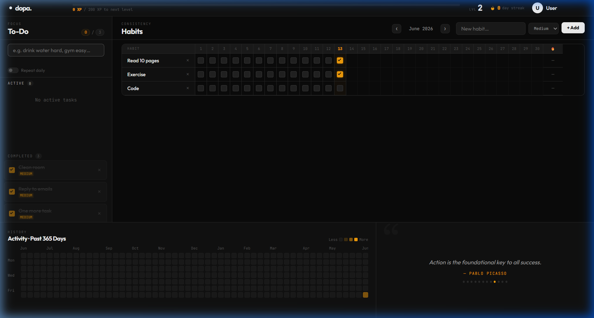

# dopa. 🎮⚡
> **Turn your habits and tasks into an RPG adventure.**

`dopa.` is a premium, minimalist, and highly interactive gamified productivity dashboard. It helps you build habits, complete daily tasks, and maintain streaks, all while earning XP, leveling up, and tracking your progress with interactive weekly charts.

---

## 📸 Preview

### Dashboard Layout


### Features in Action


---

## ✨ Features

- **🎮 RPG Character Progression**: Earn XP for completing habits and tasks. Level up your character and watch your XP bar grow.
- **🔥 Daily Global Streak**: Tracks consecutive days of discipline. You only gain/maintain your streak if **every single habit** of the day is completed!
- **⚡ Smart Task Entry**: No tedious clicking. Simply type your tasks like `todo Drink water hard` or `todo Finish assignment medium` and the app will automatically parse the task and set its difficulty.
- **📈 Weekly Analytics**: A visual, interactive SVG completion graph showing your daily productivity over the past 7 days.
- **✨ Micro-interactions**: Smooth gradients, glassmorphism, responsive hover animations, and tactile check buttons.
- **💾 Local Storage Persistence**: All stats, habits, and tasks are automatically saved locally on your device.

---

## 🛠️ How to Run Locally

Since the project is built with vanilla HTML, CSS, and JavaScript, you don't need any complex installation steps:

1. **Clone the repository:**
   ```bash
   git clone https://github.com/HedlanQ/Dopa.git
   cd Dopa
   ```

2. **Serve the project:**
   You can run it simply by opening `index.html` in your browser. For the best experience (and to avoid potential caching issues), serve it using a lightweight local server:
   
   If you have Node.js installed, run:
   ```bash
   npx http-server -p 8003
   ```
   Then open `http://localhost:8003` in your browser.

---

## 🎮 Game Rules & Mechanics

### XP System
* **Easy Tasks/Habits**: `+10 XP`
* **Medium Tasks/Habits**: `+20 XP`
* **Hard Tasks/Habits**: `+40 XP`
* **Perfect Day Bonus**: Complete all daily habits to receive a `+5 XP` bonus!

### Leveling Up
* Each level requires progressively more XP to complete.
* The XP required to level up is calculated dynamically: `Level * 100`.

### Streak Rules
* The 🔥 **Global Streak** increments by 1 at the end of the day only if you checked off **100% of your habits**.
* If you miss even a single habit, the streak resets to 0. Keep the momentum going!
